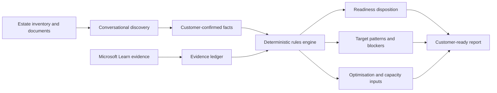

# Fabric Migration Readiness & Optimisation Assistant

> **Hackathon submission — Sept Chats & Hacks, Table 10**

## The pitch

Fabric migration conversations often begin with spreadsheets, architecture diagrams, incomplete assumptions, and a deceptively simple question:

**"Are we ready to move to Microsoft Fabric?"**

Today, answering that question can take days of workshops and depends heavily on the experience of the individual architect. Guidance can become inconsistent, missing facts are easily mistaken for safe defaults, and recommendations can age as Fabric evolves.

The **Fabric Migration Readiness & Optimisation Assistant** turns that fragmented discovery process into a guided, explainable, and repeatable assessment. It helps a Cloud Solution Architect import an estate, confirm the facts that actually change a decision, apply deterministic readiness rules, retrieve current Microsoft Learn evidence, and produce a customer-ready migration roadmap.

**In two minutes, the prototype can turn a confirmed estate inventory into:**

- a workload-by-workload disposition: **Ready**, **Optimise**, **Redesign**, or **Needs Discovery**;
- recommended Fabric target patterns;
- visible blockers, risks, and unanswered questions;
- prioritised optimisation actions;
- directional capacity and SKU Estimator inputs; and
- an executive summary that can anchor the next customer conversation.

This is not another chatbot offering plausible advice. It is a **governed decision-support workflow** where confirmed customer facts, current product evidence, and testable assessment rules remain separate.

## Why it matters

| Challenge today | What the assistant changes |
|---|---|
| Discovery is slow and interview-heavy | Imports an estate and asks the next highest-value questions in small batches |
| Different architects may reach different conclusions | Applies the same versioned, deterministic rules to the same confirmed facts |
| Missing information is easily hidden by assumptions | Keeps unknowns visible as **Needs Discovery** instead of guessing |
| Product guidance changes over time | Grounds current support claims in Microsoft Learn evidence retrieved for the engagement |
| A readiness score can hide the real work | Explains blockers, target patterns, optimisation actions, and open questions per workload |
| Capacity conversations start too early | Produces directional estimator inputs and explicitly requires telemetry validation |
| Valuable CSA knowledge is hard to reuse | Packages the workflow as a Copilot skill, agent, engine, tests, and reusable playbook |

## What makes this different

1. **Evidence-aware, not memory-led**  
   Current product claims are retrieved from Microsoft Learn and recorded with their source and retrieval date.

2. **Deterministic where decisions matter**  
   Generative AI guides discovery and explains results; a versioned Python engine calculates the readiness outcome.

3. **No guessed facts**  
   Imported rows remain **Needs Discovery** until decision-changing inputs are explicitly confirmed.

4. **Explainable by design**  
   Every disposition can be traced back to customer-confirmed facts and a rule.

5. **Built for reuse, not just a demo**  
   The kit includes a standalone prototype, three validated industry scenarios, a Copilot workspace, automated tests, a CSA playbook, and a production roadmap.

6. **Safe engagement boundaries**  
   The shared repository contains fictional data only. Real customer data stays in an isolated engagement workspace.

## See it in action

### Fastest path: two-minute video

Watch the [two-minute narrated demo](./02-Video/Fabric_Migration_Readiness_Assistant_2min_Demo.mp4).

### Interactive path: no installation required

1. Download or clone this repository.
2. Open [the standalone prototype](./03-Prototype-and-Testing/Fabric_Migration_Readiness_Assistant.html) in Edge or Chrome.
3. Select **Reset**.
4. Upload one of the fictional assessed estates from [`03-Prototype-and-Testing/scenarios/`](./03-Prototype-and-Testing/scenarios/):
   - Northwind Healthcare — expected readiness: **66%**
   - Woodgrove Financial Services — expected readiness: **64%**
   - Contoso Energy & Utilities — expected readiness: **64%**
5. Explore **Workloads**, **Assessment**, and **Summary** to see the recommendations and blockers.

The scenarios deliberately contain a mix of Ready, Optimise, and Redesign outcomes. Follow the [team test guide](./03-Prototype-and-Testing/scenarios/TEAM_TEST_GUIDE.md) for the expected results.

### Hackathon presentation path

- Open the [eight-slide pitch deck](./01-Presentation/Fabric_Migration_Readiness_Assistant_Hackathon_Deck.pptx).
- Use the [presenter and live-demo script](./01-Presentation/Fabric_Migration_Readiness_Assistant_Demo_Script.txt).
- Play the [two-minute narrated demo](./02-Video/Fabric_Migration_Readiness_Assistant_2min_Demo.mp4).

## How it works



The separation is intentional:

- **Copilot** runs adaptive discovery and helps retrieve evidence.
- **The customer and CSA** confirm the facts.
- **The rules engine** computes the outcome.
- **The report layer** presents the result without changing it.

Read the [future architecture](./04-Future-Architecture/FUTURE_ARCHITECTURE.md) for the production design, governance controls, engagement isolation model, and phased roadmap.

## Repository map

```text
Sept Chats & Hacks - Table 10/
├── 01-Presentation/             Pitch deck and presenter script
├── 02-Video/                    Two-minute demo and narration
├── 03-Prototype-and-Testing/    Standalone prototype and test scenarios
├── 04-Future-Architecture/      Production architecture and CSA reuse playbook
├── 05-Copilot-Workspace/        Copilot agent, skill, and Microsoft Learn MCP config
├── 06-Assessment-Engine/        Python engine, knowledge base, examples, and tests
├── ARTIFACT_MANIFEST.csv        SHA-256 inventory of the packaged kit assets
├── INSTALL_SKILL.md             Copilot skill installation instructions
├── START_HERE.md                Guided tour of the complete enablement kit
└── VERSION.txt                  Build and engine version
```

## Run the assessment engine

The interactive HTML demo is installation-free. To run the deterministic engine and its tests:

```powershell
cd "06-Assessment-Engine"
python -m venv .venv
.\.venv\Scripts\python -m pip install -e ".[dev]"

.\.venv\Scripts\python -m fabric_adoption_assistant.cli assess examples\sample_intake.yaml `
  --json-out examples\generated_report.json `
  --html-out examples\generated_report.html

.\.venv\Scripts\python -m pytest -q
```

See the [engine README](./06-Assessment-Engine/README.md) for the complete CLI workflow and data contracts.

## Use it in a CSA engagement

The reusable workflow is designed to:

1. import an inventory without treating extracted text as confirmed truth;
2. ask no more than three focused questions at a time;
3. prioritise blockers, target patterns, connectivity, security, scale, and concurrency;
4. retrieve current Microsoft Learn evidence for product-support claims;
5. run the deterministic assessment;
6. review unknowns and high-impact recommendations; and
7. generate customer-facing HTML/PDF plus machine-readable JSON.

Start with the [CSA reuse playbook](./04-Future-Architecture/CSA_REUSE_PLAYBOOK.md) and [skill installation guide](./INSTALL_SKILL.md).

## Current prototype and roadmap

### Available now

- standalone browser prototype;
- CSV estate import and manual workload entry;
- explicit confirmation boundary;
- deterministic assessment engine;
- self-contained HTML and JSON reports;
- Copilot discovery agent and reusable skill;
- Microsoft Learn MCP configuration;
- three fictional, validated industry scenarios;
- regression tests, presentation deck, video, and facilitator material.

### Next

- pilot with 3–5 CSAs across 5–10 customer estates;
- introduce Entra ID, an API boundary, engagement storage, and an evidence ledger;
- integrate measured Fabric telemetry and capacity inputs;
- add governed rules releases and automated evidence freshness checks; and
- extend source adapters for Snowflake, Oracle, Teradata, AWS, and GCP.

## Success measures

The pilot will measure:

- time to first useful assessment;
- percentage of workloads with confirmed decision-changing facts;
- unsupported-claim and recommendation-correction rates;
- usefulness of identified blockers and next actions;
- consistency between architects assessing the same estate; and
- progression from discovery to a funded migration or optimisation plan.

## Responsible-use boundary

- All included organisations and estate data are fictional.
- Never commit real customer data, credentials, or engagement artifacts to this repository.
- Treat capacity outputs as directional until validated with measured telemetry and the Fabric SKU Estimator.
- Revalidate product-support claims against current Microsoft Learn guidance.
- Use a second-CSA review for high-impact recommendations.

## Submission

**Team:** Sept Chats & Hacks — Table 10  
**Idea:** Fabric Migration Readiness & Optimisation Assistant  
**Engine version:** 0.2.0  
**Category:** AI-assisted customer discovery, migration planning, and Microsoft Fabric adoption

